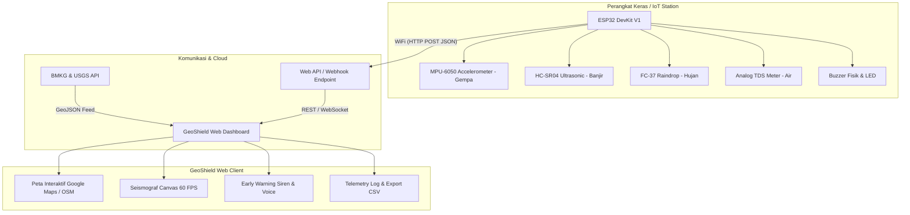

# 🌋 GeoShield EWS - Sistem Pemantauan Gempa & Multi-Bencana

[](https://github.com)
[](LICENSE)
[](firmware/)
[](index.html)

**GeoShield EWS** adalah platform open-source modern untuk sistem peringatan dini (*Early Warning System*) dan monitoring real-time berbagai potensi bencana alam: **Gempa Bumi / Seismik**, **Banjir (Level Air)**, **Curah Hujan**, dan **Kualitas Air (TDS)**. 

Dilengkapi dengan antarmuka geospasial interaktif (**Google Maps API & OpenStreetMap / Leaflet GIS**), **Seismograf Canvas Digital**, **Sirine Web Audio & Voice Alert Bahasa Indonesia**, serta firmware mikrokontroler **ESP32** siap pakai.

---

## 🌟 Fitur Utama

- 🌋 **Sensor Gempa & Seismograf Realtime**:
  - Visualisasi gelombang seismik (Z-Axis / P-wave & S-wave) pada kanvas 60 FPS.
  - Perhitungan *Peak Ground Acceleration* (PGA in $g$), percepatan Gal ($cm/s^2$), frekuensi getaran ($Hz$), estimasi Magnitudo Richter, dan intensitas skala MMI.
- 🌊 **Sistem Peringatan Banjir**:
  - Pemantauan ketinggian muka air sungai/drainase dengan gauge visual.
  - Klasifikasi status otomatis: *Normal*, *Waspada*, *Siaga*, dan *Awas* dengan zona risiko genangan air di peta.
- 🌧️ **Sensor Hujan**:
  - Deteksi intensitas curah hujan ($mm/jam$) dari analog raindrop sensor FC-37.
- 🧪 **Sensor TDS (Total Dissolved Solids)**:
  - Pemantauan partikel zat terlarut ($PPM$) dan tingkat kekeruhan/kontaminasi air pasca bencana.
- 🗺️ **Pemetaan Geospasial Interaktif**:
  - Dukungan **Google Maps JavaScript API** dan **OpenStreetMap (Dark Matter / Satellite / Street)**.
  - Pin stasiun sensor kustom yang dapat digeser (*drag-and-drop*) atau diset sesuai koordinat GPS pengguna.
  - Visualisasi dinamis lingkaran radius guncangan gempa dan risiko luapan banjir.
- 🚨 **Early Warning System (EWS)**:
  - Alarm sirine darurat otomatis berbasis **Web Audio API** (tanpa memerlukan file MP3 eksternal).
  - Pengumuman suara bahaya otomatis berbahasa Indonesia melalui **Web Speech API**.
  - Modal darurat dengan efek strobe visual.
- 📡 **Integrasi Feed Gempa BMKG & USGS**:
  - Menampilkan daftar dan marker gempa terkini dari BMKG Indonesia dan USGS global untuk verifikasi silang.
- 📥 **IoT Telemetri & Ekspor CSV**:
  - Riwayat log event sensor real-time dengan tombol unduh file rekaman `.csv`.
  - Dukungan REST Endpoint / Webhook untuk koneksi langsung perangkat keras ESP32.
- 🎮 **Simulator Bencana Interaktif**:
  - Tombol pengujian instan untuk menguji sirine dan respon sistem tanpa perlu menunggu bencana sungguhan.

---

## 📐 Arsitektur Sistem



---

## 🚀 Panduan Memulai Cepat

### 1. Menjalankan Secara Lokal di Komputer
Cukup buka file `index.html` pada web browser apa saja (Google Chrome, Edge, Firefox, Safari) atau gunakan live server:

```bash
# Menggunakan VS Code Live Server atau Python simple HTTP server:
python -m http.server 8080
```
Lalu buka: `http://localhost:8080` di browser.

### 2. Konfigurasi Lokasi Stasiun & Google Maps API
1. Klik tombol **Konfigurasi** di pojok kanan atas navbar.
2. Masukkan **Nama Stasiun** (contoh: *Posko Bencana BPBD Sleman*).
3. Masukkan koordinat **Latitude** dan **Longitude** atau klik **Gunakan Lokasi GPS Saya Saat Ini**.
4. *(Opsional)* Masukkan **Google Maps API Key** jika ingin menggunakan layer peta Google Maps resmi. Jika dikosongkan, aplikasi akan otomatis menggunakan OpenStreetMap & Citra Satelit gratis tanpa biaya.
5. Klik **Simpan Pengaturan**.

---

## ⚡ Rangkaian Elektronika ESP32

Diagram pinout dan petunjuk upload firmware mikrokontroler:

| Sensor | Pin Sensor | Pin ESP32 | Keterangan |
|---|---|---|---|
| **MPU-6050 (Gempa)** | SCL, SDA, VCC, GND | GPIO 22, GPIO 21, 3.3V, GND | Akselerasi 3-Sumbu I2C |
| **HC-SR04 (Muka Air)** | TRIG, ECHO, VCC, GND | GPIO 5, GPIO 18, 5V, GND | Sensor Jarak Ultrasonik |
| **FC-37 (Hujan)** | A0 Analog, VCC, GND | GPIO 34, 3.3V, GND | Sensor Tetesan Hujan ADC |
| **TDS Meter (Air)** | Signal A0, VCC, GND | GPIO 35, 3.3V/5V, GND | Deteksi Partikel PPM Air |
| **Buzzer Alarm** | Positif (+), GND | GPIO 4, GND | Sirine Peringatan Fisik |

File source code mikrokontroler lengkap: [firmware/esp32_disaster_station.ino](firmware/esp32_disaster_station.ino)  
Panduan diagram lengkap: [firmware/WIRING_DIAGRAM.md](firmware/WIRING_DIAGRAM.md)

---

## 🌐 Panduan Deploy ke GitHub Pages

Aplikasi ini 100% *client-side ready*, sehingga dapat langsung di-host gratis di **GitHub Pages**:

### Langkah 1: Buat Repository Baru di GitHub
1. Buka [github.com/new](https://github.com/new).
2. Beri nama repository, misalnya: `geoshield-disaster-ews`.
3. Pilih status **Public**.
4. Klik **Create repository**.

### Langkah 2: Upload / Push Kode ke Repository
Jalankan perintah berikut di terminal folder proyek:

```bash
git init
git add .
git commit -m "feat: initial commit GeoShield EWS dashboard and firmware"
git branch -M main
git remote add origin https://github.com/USERNAME_ANDA/geoshield-disaster-ews.git
git push -u origin main
```

### Langkah 3: Aktifkan GitHub Pages
1. Masuk ke halaman repository Anda di GitHub.
2. Buka tab **Settings** -> **Pages** (di sidebar kiri).
3. Pada bagian **Build and deployment**:
   - Source: Pilih **Deploy from a branch** (atau gunakan GitHub Actions workflow bawaan di `.github/workflows/deploy.yml`).
   - Branch: Pilih `main` / `root` (`/`).
4. Klik **Save**.
5. Tunggu sekitar 1 menit, web dashboard Anda akan aktif di:  
   `https://USERNAME_ANDA.github.io/geoshield-disaster-ews/`

---

## 📄 Lisensi

Proyek ini bersifat open-source di bawah lisensi [MIT License](LICENSE). Bebas digunakan, dimodifikasi, dan didistribusikan untuk keperluan penelitian, mitigasi bencana, edukasi, maupun komersial.
